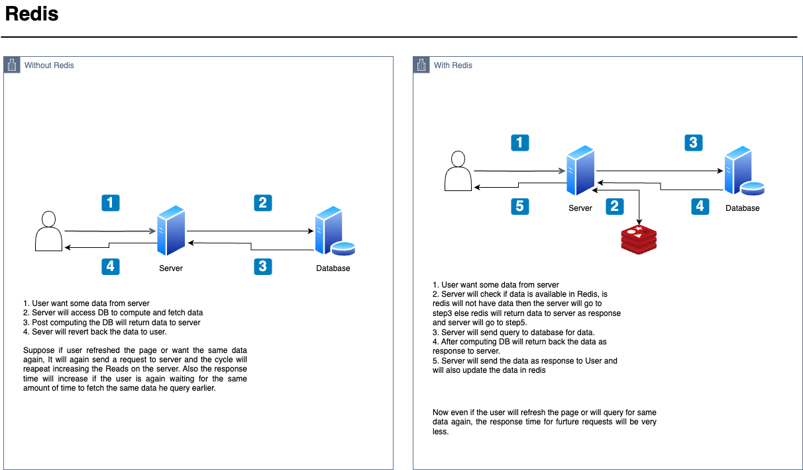

# redis-crash
Redis is an Open source in-memory database. It is used by developers as a database, cache, streaming engine, and message broker.

## Use case - as Cache

In this project we are running Redis server in Docker and will be exposing port:6379. For better understanding and visualization of redis working we will be using Redis stack. For visualization we will be exposing port:8001.